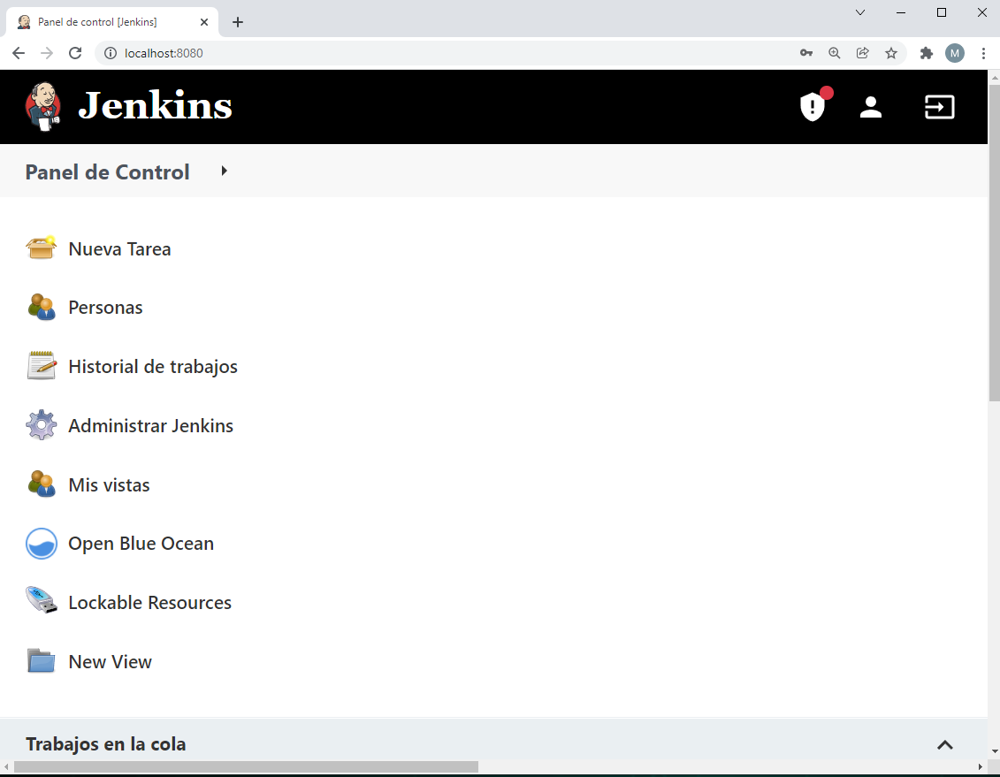
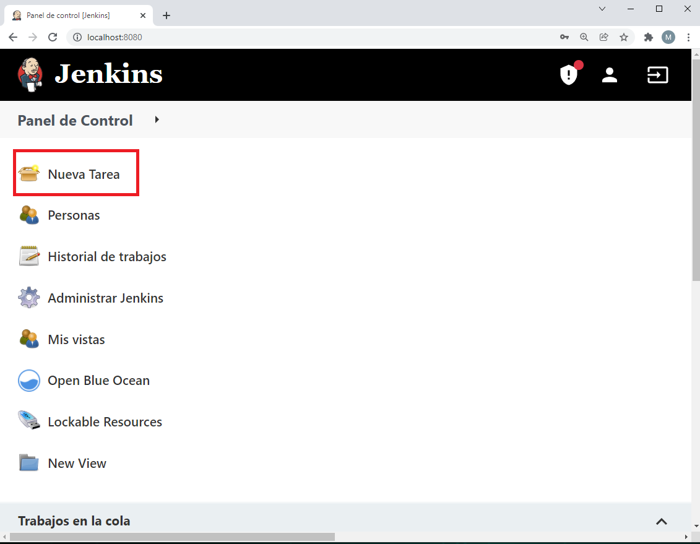
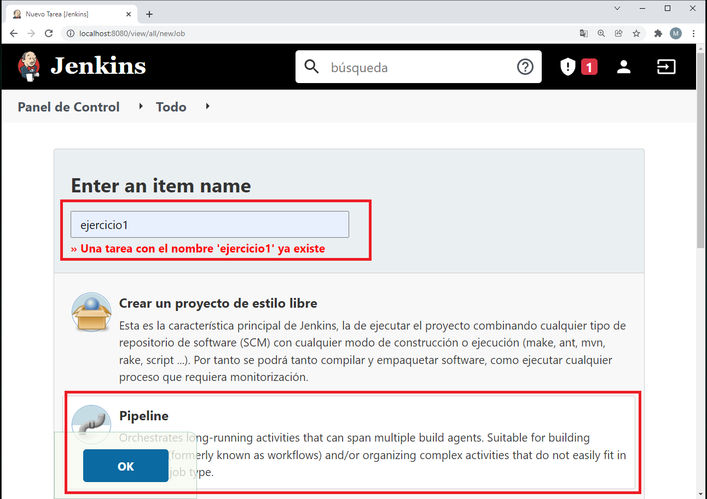
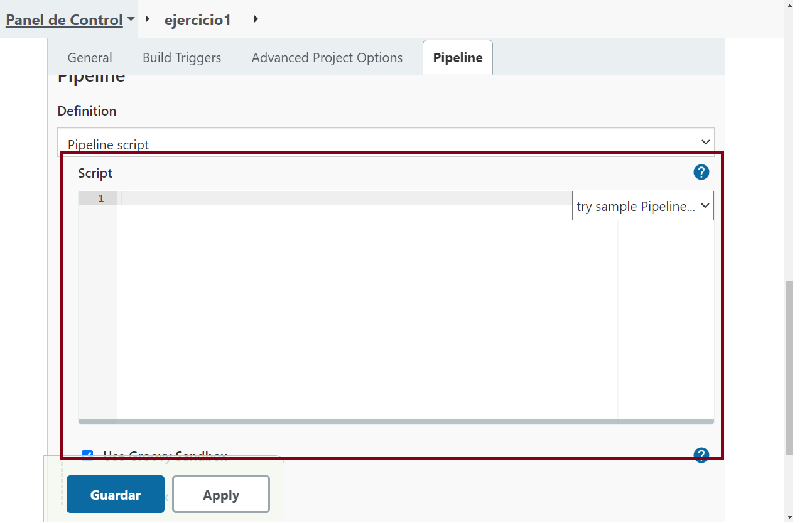
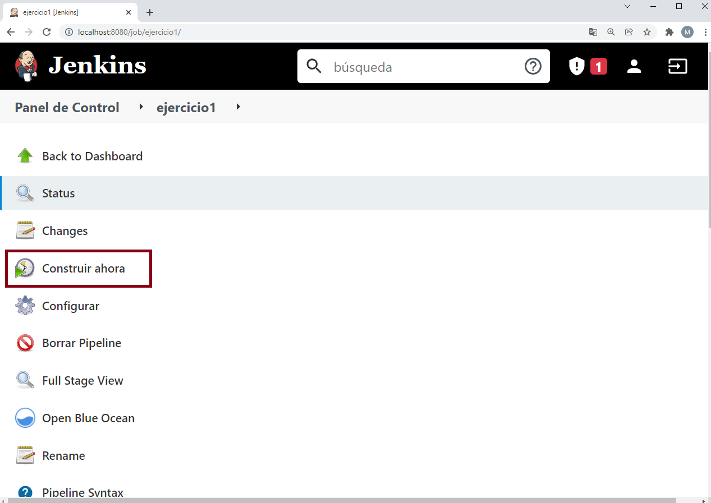

# Jenkins Laboratory

## Configuración del entorno

- Abre un terminal, creamos una red de Docker

```bash
docker network create jenkins
```

- Para ejecutar los comandos de Docker dentro de los nodos de Jenkis, descargamos la imagen de docker:dind. Donde mapeamos los certificados para poder realizar peticiones.

```bash
docker run --name jenkins-docker --rm --detach \
  --privileged --network jenkins --network-alias docker \
  --env DOCKER_TLS_CERTDIR=/certs \
  --volume jenkins-docker-certs:/certs/client \
  --volume jenkins-data:/var/jenkins_home \
  --publish 2376:2376 \
  docker:dind --storage-driver overlay2
```

Personalizamos la imagen oficial de Jenkins Docker, en los siguientes pasos:

- Creamos el Dockerfile:

```dockerfile
FROM jenkins/jenkins:2.319.2-jdk11
USER root
RUN apt-get update && apt-get install -y lsb-release
RUN curl -fsSLo /usr/share/keyrings/docker-archive-keyring.asc \
  https://download.docker.com/linux/debian/gpg
RUN echo "deb [arch=$(dpkg --print-architecture) \
  signed-by=/usr/share/keyrings/docker-archive-keyring.asc] \
  https://download.docker.com/linux/debian \
  $(lsb_release -cs) stable" > /etc/apt/sources.list.d/docker.list
RUN apt-get update && apt-get install -y docker-ce-cli
USER jenkins
RUN jenkins-plugin-cli --plugins "blueocean:1.25.2 docker-workflow:1.27"
```

- Creamos una imagen a partir del Dockerfile:

```bash
docker build -t myjenkins-blueocean:2.319.2-1 .
```

- Creamos el contenedor para la siguiente imagen:

```bash
docker run --name jenkins-blueocean --rm --detach \
  --network jenkins --env DOCKER_HOST=tcp://docker:2376 \
  --env DOCKER_CERT_PATH=/certs/client --env DOCKER_TLS_VERIFY=1 \
  --publish 8080:8080 --publish 50000:50000 \
  --volume jenkins-data:/var/jenkins_home \
  --volume jenkins-docker-certs:/certs/client:ro \
  myjenkins-blueocean:2.319.2-1
```

## Abriendo Jenkins en el navegador

- Escribimos http://localhost:8080 en el navegador y aparece la página de *Unlock Jenkins*

- Vemos los logs del contenedor para coger la clave que nos pide.

```bash
docker logs -f jenkins-blueocean
```

- Aquí vemos la clave que hay que pegar en *Unlock Jenkins*

```bash
*************************************************************
*************************************************************
*************************************************************

Jenkins initial setup is required. An admin user has been created and a password generated.
Please use the following password to proceed to installation:

1b89f0388fda4105b9ae2049615cfac8  <-------- **Esta es la que hay que copiar**

This may also be found at: /var/jenkins_home/secrets/initialAdminPassword

*************************************************************
*************************************************************
*************************************************************
```

- Nos registramos y ya estaremos en la dashboard de Jenkins.



- Agregamos nueva tarea.




- Escribimos el nombre del *ítem*, pulsamos en *Pipeline* y damos a *OK*



- Bajamos para abajo y aquí escribimos los *scrips* y **Guardamos** no hacemos *Apply* .



- Y le damos a construir ahora.




## Ejercicios

### 1 - CI/CD de una Java + Gradle

- Esta es la Pipeline.

*./03-ci/01-jenkins/src/exercises/1.1/Jenkinsfile*

```bash
pipeline {
  agent any
  stages {
    stage('Checkout') {
      steps {
          git branch: 'master',
            url: 'https://github.com/manudous/entregas-bootcamp-devops'  
      }
    }
    stage('Compile') {
      steps {
        dir('./03-ci/01-jenkins') {
          echo "Building source code"
          sh '''
            chmod +x ./gradlew
            ./gradlew
          '''
        }
      }
    }
    stage('Unit Test') {
      steps {
        dir('./03-ci/01-jenkins') {
          echo "Testing source code"
          sh './gradlew test'
        }
      }
    }
  }
}
```

### 2 - Modificar la pipeline para que utilice la imagen Docker de Gradle como build runner

- Su pipeline:

*./03-ci/01-jenkins/src/exercises/2.1/Jenkinsfile*

```bash
pipeline {
  agent {
    docker {
        image 'gradle:6.6.1-jre14-openj9'
    }
  }
  stages {
    stage('Checkout') {
      steps {
          git branch: 'master',
            url: 'https://github.com/manudous/entregas-bootcamp-devops'  
      }
    }
    stage('Compile') {
      steps {
        dir('./03-ci/01-jenkins') {
          echo "Building source code"
          sh '''
            chmod +x ./gradlew
            ./gradlew
          '''
        }
      }
    }
    stage('Unit Test') {
      steps {
        dir('./03-ci/01-jenkins') {
          echo "Testing source code"
          sh './gradlew test'
        }
      }
    }
  }
}
```

